# Trigger Map: kmanager

**Date:** 2026-06-02
**Version:** 1.0
**Methodology:** WDS Trigger Mapping (adapted from Impact/Effect Mapping)

---

## Visual Map

```mermaid
graph TD
    BG1["🎯 Become More Profitable<br/>20% margin, 10% YoY revenue,<br/>new branch within 18 months"]
    BG2["🎯 Deliver Error-Free Service<br/><10 billing disputes/month,<br/>4.5+ rating, <2 min order-to-kitchen"]
    BG3["🎯 Operate More Efficiently<br/>-50% admin time,<br/>no-shift training, <3 min check-in"]
    
    PRODUCT["🏢 kmanager<br/>Unified Karaoke & Restaurant<br/>Management Platform"]
    
    BG1 --> PRODUCT
    BG2 --> PRODUCT
    BG3 --> PRODUCT
    
    PRODUCT --> P1["👥 Cashier/Front Desk<br/>PRIMARY"]
    PRODUCT --> P2["👥 Venue Manager/Owner<br/>PRIMARY"]
    PRODUCT --> P3["👤 Floor Staff/Waiter<br/>SECONDARY"]
    PRODUCT --> P4["👤 Kitchen/Bar Staff<br/>SECONDARY"]
    
    P1 --> D1["✅ Close bills fast & accurately<br/>HIGH 14"]
    P1 --> D2["✅ Switch between rooms instantly<br/>HIGH 14"]
    P1 --> D3["❌ Fear billing errors → angry customers<br/>HIGH 15"]
    P1 --> D4["❌ Stress during peak hour rush<br/>MEDIUM 13"]
    
    P2 --> D5["✅ See real-time revenue dashboard<br/>HIGH 15"]
    P2 --> D6["✅ Scale to new branches seamlessly<br/>MEDIUM 12"]
    P2 --> D7["❌ Fear revenue leakage from staff errors<br/>HIGH 15"]
    P2 --> D8["❌ Frustration with end-of-day reconciliation<br/>HIGH 14"]
    
    P3 --> D9["✅ Take orders at-table without running back<br/>HIGH 14"]
    P3 --> D10["✅ See room availability at a glance<br/>MEDIUM 13"]
    P3 --> D11["❌ Fear wrong orders → customer complaints<br/>HIGH 15"]
    P3 --> D12["❌ Embarrassment from double-charging<br/>MEDIUM 11"]
    
    P4 --> D13["✅ See incoming orders in real time<br/>HIGH 15"]
    P4 --> D14["✅ Mark items as prepared/sold out<br/>MEDIUM 12"]
    P4 --> D15["❌ Confusion: which room ordered what<br/>HIGH 14"]
    P4 --> D16["❌ Missed orders → kitchen delays<br/>HIGH 14"]
```

---

## 1. Business Goals

### Goal 1: Become More Profitable
*Primary outcome — the system must drive revenue and margin.*

- **Objective 1.1:** Maintain 20%+ profit margin per branch through accurate billing and reduced leakage
- **Objective 1.2:** Grow revenue 10% year-over-year via faster room turnover and upselling visibility
- **Objective 1.3:** Open at least 1 new branch within 18 months (system must scale to multi-venue)

### Goal 2: Deliver Error-Free, Fast Service
*Prerequisite — customer experience drives repeat business.*

- **Objective 2.1:** Keep billing disputes under 10 per month per branch (target: near zero)
- **Objective 2.2:** Maintain 4.5+ rating on review platforms driven by service speed and accuracy
- **Objective 2.3:** Order-to-kitchen latency under 2 minutes (from waiter tap to kitchen display)

### Goal 3: Operate More Efficiently
*Prerequisite — staff productivity and cost control.*

- **Objective 3.1:** Reduce end-of-day reconciliation from 45+ minutes to under 10 minutes
- **Objective 3.2:** New staff productive within their first shift (no multi-day training on systems)
- **Objective 3.3:** Room check-in/out process under 3 minutes including customer details and first order

---

## 2. Product / Solution

**kmanager** — A unified web-based management platform for karaoke venues and restaurants. Combines menu management, room tracking, and cashier operations into a single integrated system. Built for reliability with Java 21 + Spring Boot + PostgreSQL backend, with a ReactJS frontend optimized for standard SMB hardware.

---

## 3. Target Groups & Personas

### Persona 1: Minh the Cashier — Priority 1 (PRIMARY 👥)

**Who Minh Is:**
Minh works the front desk at a busy karaoke venue in District 7, Ho Chi Minh City — typically the evening shift from 6pm to midnight. She handles 15-20 rooms per shift, managing check-ins, taking initial orders, adding items throughout sessions, and closing bills. She's been doing this for two years and knows the regular customers by name.

**Psychological Profile:**
Minh values **speed and accuracy above all else**. Every minute she spends calculating a bill manually is a minute a customer is waiting at the counter — and waiting customers get impatient. She has developed **informal shortcuts and mental math tricks** to survive peak hours (Friday/Saturday, 8-11pm) but lives in constant **low-grade anxiety about making mistakes**. She has been yelled at twice for billing errors and those memories stick. When the system works smoothly, she feels **competent and in control**. When it doesn't, she feels **cornered and defensive**.

**Internal State:**
When Minh starts her shift, she feels a mix of **readiness and apprehension**. The first hour (6-7pm) is manageable — early customers, steady flow. But she knows peak hour is coming, and the dread builds. At 9pm on a Saturday with 12 rooms active, 3 waiting to check in, and 4 bills to close, she's in **survival mode** — tunnel vision, reactive, praying she doesn't mess up. When the last bill closes and the till balances, the relief is **visceral**.

**Usage Context:**
- **Access:** Logs into kmanager on the front desk terminal when her shift starts. Keeps it open all night on a 24" monitor alongside the phone.
- **Emotional State During Use:** Urgent, focused, switching context constantly. Flipping between room tabs like a trader watching stocks.
- **Behavior Pattern:** Keyboard-heavy, mouse-averse. Wants to type a room number and see everything instantly. Hates clicking through menus.
- **Decision Criteria:** "Can I close this bill in under 30 seconds?" If yes, the tool works. If not, she'll find workarounds or revert to paper.
- **Success Outcome:** All rooms closed accurately, till matches system, zero customer complaints — and she gets home before 12:30am.

**Relationship to Business Goals:**
- ✅ **Become More Profitable:** Minh is the last line of defense against revenue leakage — accurate billing = profit captured. Fast room turnover means more sessions per night.
- ✅ **Deliver Error-Free Service:** Billing accuracy lives or dies at her station. Every dispute traces back to her terminal.
- ✅ **Operate More Efficiently:** Her check-in/out speed directly determines room turnaround time and customer wait.

---

### Persona 2: Mr. Hùng the Owner — Priority 1 (PRIMARY 👥)

**Who Mr. Hùng Is:**
Hùng owns two karaoke venues in Hanoi and is planning a third. He's in his early 40s, built the business from one small venue to where it is now over 8 years. He's at the venues 5-6 days a week but can't be everywhere at once. He manages via WhatsApp, phone calls, and spreadsheets — a system that worked for one venue but is breaking down at two.

**Psychological Profile:**
Hùng has an **entrepreneur's instinct for numbers but no time for admin**. He can sense when revenue "feels off" before seeing data, but he can't prove it without spending hours reconciling. His biggest frustration is **lack of visibility** — he walks into his second venue and has no idea how it performed last night until someone pulls up a spreadsheet. He wants to **grow aggressively** but knows he can't scale with the current manual systems. He's **decisive and pragmatic** — will adopt any tool that shows clear ROI, but has no patience for complex software that requires consultants to set up.

**Internal State:**
Hùng operates with a constant **low-grade worry about things slipping through the cracks**. When he's at Venue A, he wonders what's happening at Venue B. End-of-month is stressful — compiling revenue reports from paper bills and spreadsheets takes days. He dreams of opening Venue 3 but the thought of tripling the admin overhead makes him **hesitant and frustrated**. He feels **stuck between growth ambition and operational reality**.

**Usage Context:**
- **Access:** Opens kmanager from his laptop at home (morning), his phone during the day (quick checks), and his office computer at the main venue.
- **Emotional State During Use:** Scanning for problems. Looking for red flags. "Did last night go well? Show me the numbers."
- **Behavior Pattern:** Dashboard-first. Wants the headline numbers immediately — revenue, room utilization, open disputes. Drills down only when something looks wrong.
- **Decision Criteria:** "Can I understand last night's performance in under 60 seconds?" If yes, he'll use it daily. If it takes minutes of clicking, he'll go back to WhatsApp.
- **Success Outcome:** Opens dashboard, sees both venues performed as expected, closes laptop, focuses on growth — not firefighting.

**Relationship to Business Goals:**
- ✅ **Become More Profitable:** Hùng owns the P&L. Revenue growth, margin protection, and branch expansion all land on him. The system must prove ROI.
- ✅ **Deliver Error-Free Service:** Customer complaints eventually reach him. Fewer disputes = less time firefighting.
- ✅ **Operate More Efficiently:** His personal admin time is the biggest bottleneck to scaling. Automating reconciliation is a direct growth enabler.

---

### Persona 3: Thảo the Floor Staff — Priority 2 (SECONDARY 👤)

**Who Thảo Is:**
Thảo is a 22-year-old floor server at a karaoke-restaurant combo venue. Her job is to take food/drink orders from rooms, deliver items, clear tables, and respond to customer requests. On a busy night she handles 6-8 rooms simultaneously, walking kilometers back and forth between rooms and the kitchen/bar counter.

**Psychological Profile:**
Thảo is **energetic and people-oriented** — she enjoys interacting with customers and takes pride in remembering regulars' favorite dishes. But the **physical logistics wear her down**. Running to the counter to place every order, then running back to check if it's ready, then delivering — it's exhausting and makes her feel more like a courier than a server. She's **embarrassed when orders are wrong** because the customer blames her, not the kitchen. She wants to spend more time with customers and less time doing laps of the venue.

**Internal State:**
At the start of shift, Thảo is **upbeat and social**. By hour 3 she's **physically tired and mentally scattered** — trying to remember which room ordered the extra spring rolls, whether Room 5 already paid, whether Room 8 is about to check out. She feels **invisible to management** — they see the customer complaints about slow service but don't see how hard she's working.

**Usage Context:**
- **Access:** Uses a mobile tablet or her own phone in a web browser. Needs to tap orders quickly while standing in a dimly lit room with music playing.
- **Emotional State During Use:** In a hurry, context-switching. "Table 3 wants two beers and fried chicken — tap tap tap, done, next room."
- **Behavior Pattern:** Thumb-friendly, one-handed. Large buttons, minimal typing. Should work in under 10 seconds per order.
- **Decision Criteria:** "Did the order reach the kitchen?" Needs instant confirmation so she doesn't have to double-check.
- **Success Outcome:** Orders reach kitchen instantly, she delivers the right items to the right room, customers are happy, and she still has energy at end of shift.

**Relationship to Business Goals:**
- ✅ **Become More Profitable:** Faster order entry → faster service → more orders per night → higher revenue.
- ✅ **Deliver Error-Free Service:** Order accuracy starts with Thảo. Wrong orders = wasted food and unhappy customers.
- ✅ **Operate More Efficiently:** Reducing her walking time increases the number of rooms she can handle, reducing staffing needs.

---

### Persona 4: Bếp Trưởng Nam — Priority 2 (SECONDARY 👤)

**Who Chef Nam Is:**
Nam is the head chef at the venue's kitchen. He manages a team of 3 cooks and 2 prep staff. Orders come in via handwritten tickets that floor staff drop off — or sometimes just shouted verbally through the pass-through window. During peak hours, the ticket rail gets crowded, tickets get lost or misread, and tempers flare.

**Psychological Profile:**
Nam is a **craftsman who takes pride in his food** but feels undermined by a chaotic ordering system. He can cook a dish in 8 minutes but spends 30 seconds trying to read messy handwriting. When a server comes back asking "where's the beef noodle for Room 7?" and he has no record of it, it breaks his rhythm and makes him **angry at the system, not the server**. He's not tech-averse — he uses a smartphone — but he has **zero patience for complicated interfaces**. If the kitchen display isn't instantly readable from 2 meters away in a steamy environment, he'll ignore it.

**Internal State:**
During peak hours (7-10pm), Nam is in **battle mode** — intense focus, loud communication, moving fast. Interruptions are infuriating. When orders come through clearly and in sequence, he enters a **flow state** and the kitchen hums. When orders are missing, duplicated, or illegible, he gets **frustrated and vocal** — and the whole kitchen suffers.

**Usage Context:**
- **Access:** A wall-mounted tablet or dedicated monitor at the kitchen pass. Not something he touches — something he glances at.
- **Emotional State During Use:** Not "using" in the traditional sense. The display is ambient — it should show him what to cook next without him having to interact.
- **Behavior Pattern:** Glance-based. New orders must visually pop. Completed orders must be easy to mark done with one tap. Zero tolerance for login screens or page reloads.
- **Decision Criteria:** "Can I see the next 5 orders from 2 meters away?" If not, the display is useless.
- **Success Outcome:** Every order is cooked in sequence, no lost tickets, no wrong dishes, kitchen closes on time.

**Relationship to Business Goals:**
- ✅ **Become More Profitable:** Kitchen throughput = revenue ceiling. Faster cooking = more orders fulfilled.
- ✅ **Deliver Error-Free Service:** Wrong or missing dishes are the #1 source of customer complaints involving the kitchen.
- ✅ **Operate More Efficiently:** Eliminating lost tickets and verbal orders reduces food waste and re-cooks.

---

## 4. Driving Forces & Prioritization

### Cashier / Front Desk — Minh

| # | Driving Force | Type | F | I | T | Score | Priority |
|---|--------------|------|---|---|---|-------|----------|
| D1 | Close bills fast and accurately — wants to process a full bill including room time + all items in under 30 seconds without mental math | ✅ Positive | 5 | 5 | 4 | **14** | HIGH |
| D2 | Switch between rooms instantly and see live status — juggling 12+ active rooms, needs to know which room is checking in, which has ordered, which is ready to close | ✅ Positive | 5 | 5 | 4 | **14** | HIGH |
| D3 | Fear of billing errors leading to angry customer confrontations — has been yelled at before, every calculation carries anxiety, especially during peak hours | ❌ Negative | 5 | 5 | 5 | **15** | HIGH |
| D4 | Stress and overwhelm during Friday/Saturday peak hours — when 15 rooms are active and 3 customers are waiting, she's in survival mode and more likely to make mistakes | ❌ Negative | 4 | 5 | 4 | **13** | MEDIUM |

### Venue Manager / Owner — Mr. Hùng

| # | Driving Force | Type | F | I | T | Score | Priority |
|---|--------------|------|---|---|---|-------|----------|
| D5 | See real-time revenue and room utilization at a glance — wants to open a dashboard and understand both venues' performance in under 60 seconds | ✅ Positive | 5 | 5 | 5 | **15** | HIGH |
| D6 | Scale to new branches without tripling admin work — growth ambition blocked by operational reality; needs the system to make branch #3 as easy to oversee as branch #1 | ✅ Positive | 3 | 5 | 4 | **12** | MEDIUM |
| D7 | Fear of revenue leakage from staff errors or intentional underreporting — suspects money is being lost but can't prove it without spending hours on reconciliation | ❌ Negative | 5 | 5 | 5 | **15** | HIGH |
| D8 | Frustration with end-of-day reconciliation taking 45+ minutes — month-end is worse; this admin burden is the single biggest barrier to opening new venues | ❌ Negative | 5 | 4 | 5 | **14** | HIGH |

### Floor Staff / Waiter — Thảo

| # | Driving Force | Type | F | I | T | Score | Priority |
|---|--------------|------|---|---|---|-------|----------|
| D9 | Take food/drink orders at the room without running to the counter — wants to tap an order on a tablet and have it reach the kitchen instantly so she can stay with customers | ✅ Positive | 5 | 5 | 4 | **14** | HIGH |
| D10 | See room availability and status at a glance — when seating walk-in customers, needs to know which rooms are free, which are occupied, which are about to check out | ✅ Positive | 4 | 4 | 5 | **13** | MEDIUM |
| D11 | Fear of wrong orders leading to customer complaints — she gets blamed even when the kitchen misreads handwriting; wants confidence that what she entered is what the kitchen sees | ❌ Negative | 5 | 5 | 5 | **15** | HIGH |
| D12 | Embarrassment from accidental double-charging or wrong-room delivery — mistakes make her look incompetent in front of customers and colleagues | ❌ Negative | 3 | 4 | 4 | **11** | MEDIUM |

### Kitchen / Bar Staff — Chef Nam

| # | Driving Force | Type | F | I | T | Score | Priority |
|---|--------------|------|---|---|---|-------|----------|
| D13 | See incoming orders in real time with room number clearly displayed — needs a display visible from 2m away in a busy, steamy kitchen that shows what to cook next | ✅ Positive | 5 | 5 | 5 | **15** | HIGH |
| D14 | Mark items as prepared or sold out with one tap — during peak hours, has no time for multi-step interactions; marking "done" must be instantaneous | ✅ Positive | 4 | 3 | 5 | **12** | MEDIUM |
| D15 | Confusion about which room ordered what — tickets get mixed up, handwriting is illegible, verbal orders are forgotten; kitchen wastes food on wrong dishes | ❌ Negative | 5 | 5 | 4 | **14** | HIGH |
| D16 | Missed or delayed orders causing kitchen delays — when an order slip falls behind the rail or is never written down, the entire kitchen timeline is disrupted | ❌ Negative | 4 | 5 | 5 | **14** | HIGH |

---

## 5. Prioritization Summary

### HIGH Priority (Score 14-15) — Must Address in Core Product

These 10 driving forces define the minimum viable experience:

1. **D3** — Fear of billing errors (Cashier, 15/15)
2. **D5** — Real-time revenue dashboard (Manager, 15/15)
3. **D7** — Fear of revenue leakage (Manager, 15/15)
4. **D11** — Fear of wrong orders (Floor Staff, 15/15)
5. **D13** — Real-time order display (Kitchen, 15/15)
6. **D1** — Fast bill closing (Cashier, 14/15)
7. **D2** — Instant room switching (Cashier, 14/15)
8. **D8** — Fast end-of-day reconciliation (Manager, 14/15)
9. **D9** — At-table order taking (Floor Staff, 14/15)
10. **D15** — Room identification on orders (Kitchen, 14/15)
11. **D16** — No missed orders (Kitchen, 14/15)

### MEDIUM Priority (Score 11-13) — Should Address

These 5 forces significantly enhance the experience:

12. **D4** — Peak hour stress (Cashier, 13/15)
13. **D6** — Multi-branch scaling (Manager, 12/15)
14. **D10** — Room availability glance (Floor Staff, 13/15)
15. **D12** — Double-charging embarrassment (Floor Staff, 11/15)
16. **D14** — One-tap order marking (Kitchen, 12/15)

### Key Insight

Negative driving forces (fears) score consistently higher than positive ones (desires). The system must be designed to **eliminate sources of error and anxiety first**, then enhance speed and convenience. The cashier's fear of billing mistakes and the manager's fear of revenue leakage are the two strongest forces in the system — they must anchor the core experience.

---

## 6. Design Implications

From these prioritized driving forces, key design requirements emerge:

1. **Auto-calculated billing is non-negotiable** — the system must compute room time × rate + ordered items without manual math (D1, D3, D7)
2. **Real-time dashboard for owner** — revenue, occupancy, and alerts visible in seconds, not minutes (D5, D7, D8)
3. **Kitchen display must be glanceable from distance** — large fonts, high contrast, room numbers prominent (D13, D15, D16)
4. **One-tap order flow for floor staff** — mobile-first, large touch targets, instant kitchen notification (D9, D11)
5. **Room-centric navigation for cashier** — all operations organized around rooms, not separate modules (D1, D2, D4)
6. **Automatic end-of-day reconciliation** — till matching, discrepancy flagging, one-click reports (D8)
